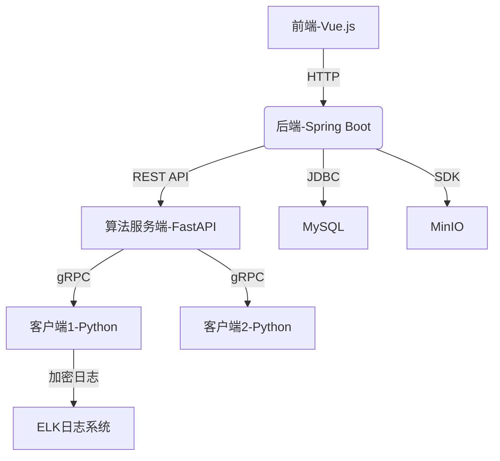

---

## **面向数据流处理的隐私计算平台（基于联邦学习的组织细胞癌症识别平台）需求分析**

---

### **一、项目背景**
为提升医疗数据隐私保护下的癌症识别效率，本项目拟搭建一个基于联邦学习的分布式平台，允许多个医疗机构在不共享原始数据的前提下协作训练深度学习模型，用于组织细胞病理图像的癌症识别。平台需支持数据可视化,模型训练参数选择,联邦学习配置选择,训练过程可视化,模型参数评估。

---

### **二、用户角色与功能需求**

#### **1. 医疗机构用户（客户端）**
- **功能需求**：
  - 数据上传：上传本地的组织细胞病理图像（支持PNG/JPG/DICOM格式）。
  - 配置文件修改:修改配置文件里面的配置
  - 任务参与：加入联邦学习任务，启动本地模型训练。
  - 训练监控：查看本地训练进度、损失曲线、资源占用（CPU/GPU）。
  - 结果下载：获取最终全局模型文件（.pt或.h5格式）。

#### **2. 计算平台使用者/研究人员（服务端前端[隐私计算的发起者]）**
- **功能需求**：
  - 参数配置:可以配置联邦学习训练的策略
  - 联邦学习配置参数包括：基础训练配置（训练轮数(num_rounds，整数1-100，默认3）、本地训练周期(num_epochs，整数1-20，默认3）；客户端参与配置（客户端总数(num_clients，整数1-50，默认5)、最小可用客户端数(min_available_clients，整数1-num_clients，默认5)、训练参与比例(fraction_fit，滑动条0.1-1.0步长0.1，默认1.0)、评估参与比例(fraction_evaluate，滑动条0.1-1.0步长0.1，默认1.0)）；网络配置（服务器地址(server_address，IP:端口格式，默认"127.0.0.1:80")）。
  - 开始训练：页面可视化配置文件的参数,然后提供训练启动按钮。
  - 训练过程展示:可视化日志文件里面,训练轮次的结果准确率,精确率,召回率,F1绘制出对应的折线图和混淆矩阵
  - 模型评估：验证轮次的结果准确率,精确率,召回率,F1绘制出对应的折线图和混淆矩阵。


### **三、系统模块需求**

#### **1. 联邦学习核心模块**
### 功能需求
1. **客户端初始化**：在 `stimulate.py` 中，每个客户端进程需要初始化模型、准备数据集，并连接到服务器。具体来说，客户端需要从 `Model.py` 中加载癌症分类模型，并根据 `Dataset.py` 中的数据加载和预处理逻辑准备训练集和验证集。
2. **模型训练**：在 `Client.py` 中，客户端需要实现模型训练的逻辑，包括设置模型参数、定义优化器和损失函数、进行多个 epoch 的训练，并在每个 epoch 中计算训练损失、准确率、精确率、召回率和 F1 分数。
3. **模型评估**：同样在 `Client.py` 中，客户端需要实现模型评估的逻辑，使用验证集对模型进行评估，并计算验证损失、准确率、精确率、召回率和 F1 分数。
4. **数据划分**：在 `stimulate.py` 中，需要将数据集划分为多个子集，每个子集分配给一个客户端进行训练和验证。

### 性能需求
1. **训练效率**：为了提高训练效率，使用了 AdamW 优化器和 BCEWithLogitsLoss 损失函数。同时，在 `stimulate.py` 中使用多进程启动多个客户端，并行进行训练。
2. **资源利用**：在 `Client.py` 中，使用 `torch.device` 来选择使用 GPU 或 CPU 进行训练，以充分利用计算资源。

### 数据处理需求
1. **数据加载**：在 `Dataset.py` 中，定义了 `CancerDataset` 类，用于加载癌症数据集。该类需要从 CSV 文件中读取数据，并根据图像文件夹路径加载图像数据。
2. **数据预处理**：在 `Dataset.py` 中，定义了训练集和验证集的数据预处理逻辑，包括图像大小调整、归一化等操作。
#### **2. 业务后端（Java Spring Boot）**
- **核心功能**：
  - 用户认证：JWT令牌签发与验证，角色权限拦截。（日后开发）
  - 任务管理：创建/终止任务，记录任务状态（数据库：MySQL）。（日后开发？）
  - 数据代理：接收前端上传的病理图像，转存至MinIO对象存储。
  - 日志收集：监听客户端日志文件，解析为JSON格式（需要存储至数据库吗？）。
  - API网关：为前端提供RESTful接口，反向代理算法服务。

- **关键接口**：
  ```text
  POST /api/tasks          # 创建联邦学习任务
  GET /api/tasks/{id}      # 查询任务状态
  POST /api/predict        # 单张图像癌症识别
  GET /api/models          # 获取所有模型版本
  ```

#### **3. 前端（Vue.js）**
- **核心页面**：
  - **仪表盘**：全局任务状态地图（显示参与机构位置）、资源占用监控。
  - **任务管理**：任务列表、进度条、实时日志滚动展示。
  - **数据看板**：模型准确率趋势图、混淆矩阵、ROC曲线。
  - **图像上传**：拖拽上传界面，支持批量上传与格式校验。
  - **报告生成**：导出PDF诊断报告（含模型置信度与医生备注）。

- **技术需求**：
  - 响应式布局：适配PC、平板及大屏显示器。
  - 可视化库：集成ECharts展示训练指标，D3.js渲染热力图。

---

### **四、非功能性需求**

#### **1. 性能需求**
（我们现在是多线程模拟，先不管）
- 并发支持：至少50个客户端同时参与联邦学习任务。
- 响应时间：  
  - 前端页面加载：< 2s（静态资源CDN加速）。  
  - 单张图像预测：< 3s（GPU加速推理）。

#### **2. 安全需求**
（联邦学习本身就有一定的安全性，先不管）
- 数据加密：客户端梯度传输使用AES-256加密。
- 隐私保护：支持差分隐私（DP）或同态加密（HE）算法。
- 访问控制：RBAC权限模型，医生仅可访问所属机构数据。

#### **3. 可靠性需求**
- 服务容错：客户端断线后自动重试，服务端模型版本回滚机制。
- 日志追踪：保留6个月操作日志，支持溯源审计。

#### **4. 可扩展性**（这个是我们以后想要的）
- 模块化设计：可快速替换聚合算法（如切换FedAvg至FedBN）。
- 横向扩展：支持动态添加客户端节点，无需重启服务。

---

### **五、系统架构图**


---

### **六、数据流说明**
1. **联邦训练流程**：
   - 管理员创建任务 → 服务端初始化模型 → 客户端下载模型 → 本地训练 → 加密梯度上传 → 服务端聚合 → 更新全局模型（循环至收敛）。

2. **癌症识别流程**：
   - 医生上传图像 → 后端调用全局模型 → 返回预测结果 → 前端渲染热力图。

---

### **七、验收标准**
1. **功能验收**：
   - 成功完成5家模拟机构的联邦训练任务，全局模型准确率 > 85%。
   - 支持1000张以上病理图像的并发预测，无服务崩溃。

2. **性能验收**：
   - 客户端梯度上传延迟 < 1s（局域网环境）。
   - 日志从生成到前端展示延迟 < 5s。

3. **安全验收**：
   - 通过OWASP ZAP扫描，无高危漏洞。
   - 客户端数据包捕获测试显示梯度为密文。

---

### **八、依赖与约束**
- **硬件依赖**：服务端需GPU（NVIDIA Tesla T4以上）加速聚合计算。
- **法律约束**：病理数据需脱敏处理，符合《医疗数据隐私保护条例》。

---
